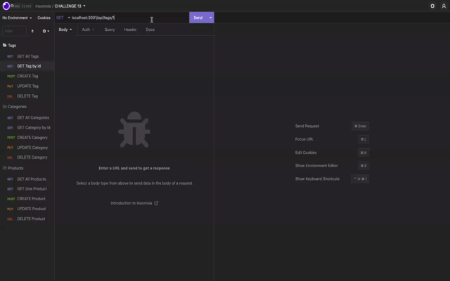

 # Back-End E-Commerce

  ## Description
  This challenge was to build the back end of an e-commerce website using the latest technologies so that the company can compete with other e-commerce companies. This was created using [MYSQL2](https://www.npmjs.com/package/mysql) and [Sequelize](https://www.npmjs.com/package/sequelize), as well as, the [Express](https://www.npmjs.com/package/express) and [dotenv](https://www.npmjs.com/package/dotenv) npm packages.

  ## Table of Contents
  * [Installation](#installation)
  * [Usage](#usage)
  * [License](#license)
  * [Questions](#questions)

  ## Installation
  `npm run seed`
   `npm run start`

  ## Usage
  * Create schema in MYSQL SHELL "source db/schema.sql"
  * RUN "npm run seed" 
  * THEN "npm run start"

  GET routes for all categories, all products, and all tags being tested in Insomnia Core
  

  GET routes for a single category, a single product, and a single tag being tested in Insomnia Core
      
  
  POST, PUT, and DELETE routes for tags, categories, and products being tested in Insomnia Core.
      

  ## License
  This application is licensed under [MIT]((https://opensource.org/licenses/MIT)). 
    Copyright &copy; 2022 

  Permission is hereby granted, free of charge, to any person obtaining a copy of this software and associated documentation files (the "Software"), to deal in the Software without restriction, including without limitation the rights to use, copy, modify, merge, publish, distribute, sublicense, and/or sell copies of the Software, and to permit persons to whom the Software is furnished to do so, subject to the following conditions:
  
  The above copyright notice and this permission notice shall be included in all copies or substantial portions of the Software.
  
  THE SOFTWARE IS PROVIDED "AS IS", WITHOUT WARRANTY OF ANY KIND, EXPRESS OR IMPLIED, INCLUDING BUT NOT LIMITED TO THE WARRANTIES OF MERCHANTABILITY, FITNESS FOR A PARTICULAR PURPOSE AND NONINFRINGEMENT. IN NO EVENT SHALL THE AUTHORS OR COPYRIGHT HOLDERS BE LIABLE FOR ANY CLAIM, DAMAGES OR OTHER LIABILITY, WHETHER IN AN ACTION OF CONTRACT, TORT OR OTHERWISE, ARISING FROM, OUT OF OR IN CONNECTION WITH THE SOFTWARE OR THE USE OR OTHER DEALINGS IN THE SOFTWARE.

  ## Questions
  If you have any questions about this project, please contact [jmotto31@gmail.com](mailto:jmotto31@gmail.com). 
   To view more of my projects, go to [jmotto](https://github.com/jmotto).

